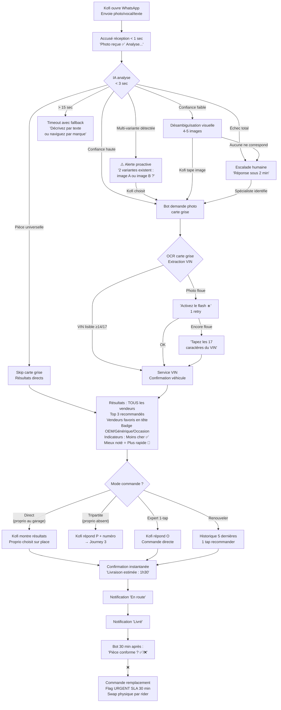
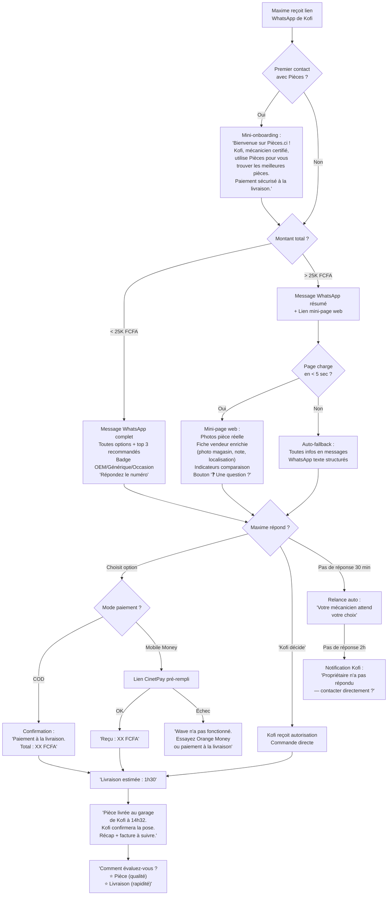
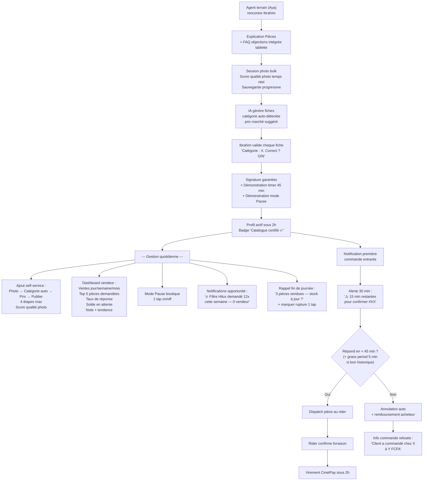
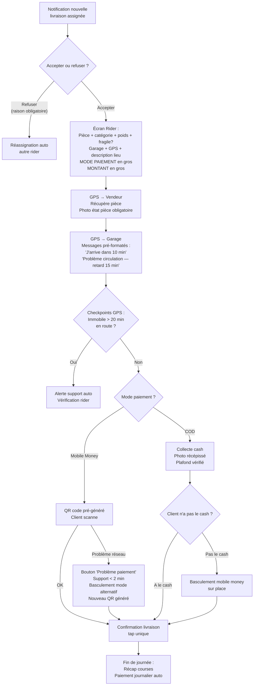
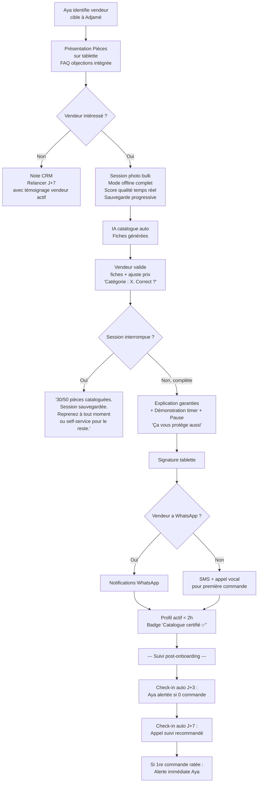

# UX Design Specification Pièces

**Author:** F
**Date:** 2026-02-28

---

<!-- UX design content will be appended sequentially through collaborative workflow steps -->

## Executive Summary

### Vision Produit

Pièces est une **marketplace tripartite de pièces détachées automobiles** (neuves et occasion) pour la Côte d'Ivoire, construite autour d'un modèle unique : le **mécanicien diagnostique et prescrit**, le **propriétaire choisit et paie** (avec transparence totale des prix), et **Pièces livre directement au garage**.

Deux canaux complémentaires servent des profils de littératie numérique radicalement différents :
- **WhatsApp bot** — canal primaire, zéro friction, comportement existant des mécaniciens
- **PWA offline-first** — navigation visuelle (marque > modèle > année > catégorie), dashboard enterprise

Le différenciateur technologique central est l'**IA de reconnaissance par photo** qui résout l'absence totale de références standardisées sur le marché ivoirien des pièces auto.

### Utilisateurs Cibles

| Persona | Profil | Pain point central | Canal préféré |
|---|---|---|---|
| **Kofi** (mécanicien) | 25-45 ans, formation informelle, Android bas de gamme, WhatsApp natif | 2-4h perdues par visite Adjamé, avance de trésorerie, aucun outil de gestion | WhatsApp |
| **Propriétaire** (classe moyenne) | 30-55 ans, urbain Abidjan, sensibilité prix | Opacité prix pièces, marges cachées mécanicien (50-200%+), aucun comparateur | WhatsApp + PWA |
| **Ibrahim** (importateur/vendeur) | PME 1-10 pers., stock 500-5000 pièces sans références | Pas de catalogue digital, vente physique uniquement, zéro data demande | PWA (back-office) |
| **Adjoua** (gestionnaire de flotte) | 10-200 véhicules, dépenses 500K-5M FCFA/mois | Pas de visibilité coûts réels, fraude interne mécaniciens | PWA (dashboard enterprise) |

### Défis UX Clés

1. **Multi-canal, multi-persona** — Le même flux (commande tripartite) doit fonctionner nativement sur WhatsApp ET sur la PWA, pour des profils de littératie numérique radicalement différents (Kofi sur WhatsApp vs Adjoua sur dashboard)
2. **Contraintes matérielles sévères** — Android 1-3 Go RAM, réseau 3G instable, écrans 5-6 pouces, images compressées obligatoires. La PWA doit être offline-first et ultra-légère
3. **Confiance comme infrastructure** — Le produit attaque un marché dominé par la relation personnelle. Le système de badges, notes, escrow et factures séparées doit inspirer confiance dès la première interaction
4. **Cold start marketplace** — L'expérience de la première recherche sans résultats pertinents peut tuer l'adoption. L'UX doit gérer gracieusement les cas "pièce non trouvée" avec des alternatives (demande inversée, notification vendeur)

### Opportunités UX

1. **"Shazam de la pièce auto"** — L'interaction photo > résultats instantanés est un moment magique qui génère du bouche-à-oreille spontané. C'est le hook viral du produit
2. **Transparence comme différenciateur émotionnel** — Afficher publiquement les prix de marché transforme Pièces en "bouclier du consommateur". Expérience émotionnellement forte (le propriétaire voit enfin la réalité)
3. **Navigation 100% visuelle** — Logos marques > modèles populaires > catégorie pièce. Zéro texte requis pour 80% des recherches. Design pensé pour la faible littératie numérique

## Core User Experience

### Expérience Définissante

L'expérience centrale de Pièces repose sur un **entonnoir d'identification à 4 niveaux avec filet humain** :

1. **Photo IA** (canal primaire) — Kofi photographie la pièce défectueuse, l'IA identifie et retourne les résultats avec prix/vendeurs en secondes
2. **VIN** (fallback structuré) — Si la photo ne suffit pas, saisie ou scan du VIN pour identifier précisément le véhicule et ses pièces compatibles
3. **Désambiguïsation visuelle** (fallback assisté) — Si photo + VIN ne donnent pas un résultat certain, l'IA propose 4-5 images de pièces possibles : "Est-ce que c'est un de ceux-là ?" Kofi tapote la bonne image. Récupère ~50% des cas "confiance faible" sans intervention humaine
4. **Prise en charge humaine** (filet de sécurité) — Si les 3 niveaux précédents échouent, escalade transparente vers un spécialiste Pièces avec promesse de délai : "Un spécialiste Pièces vérifie pour vous — réponse sous 2 minutes." Zéro impasse, zéro silence

**Ce premier processus d'identification est le moment critique.** Si le client obtient la bonne pièce rapidement — par n'importe lequel des 4 niveaux — la confiance est installée. Si on le laisse dans le vide, le produit est mort.

### Stratégie Plateforme

**Deux canaux, une expérience cohérente :**

| Canal | Rôle | Utilisateur primaire |
|---|---|---|
| **WhatsApp bot** | Canal d'entrée principal, interaction conversationnelle, envoi photo/VIN, réception résultats | Kofi (mécanicien), propriétaires peu digitalisés |
| **PWA offline-first** | Navigation visuelle, dashboard mécanicien/vendeur/enterprise, historique, catalogue | Tous les profils, usage complémentaire |

**Propriétaire — design adaptatif selon le montant de la commande :**

| Montant | Expérience | Justification |
|---|---|---|
| **< 25 000 FCFA** | **Flow WhatsApp pur** — Les options sont listées directement dans le message ("Répondez 1, 2 ou 3"), commande sans jamais quitter WhatsApp. COD = zéro sortie paiement, expérience la plus fluide | Friction minimale, correspond aux habitudes cash, pas besoin de voir des photos détaillées pour des pièces courantes |
| **> 25 000 FCFA** | **WhatsApp + lien mini-page détaillée** — Message WhatsApp avec résumé + lien vers une page web avec photos de la pièce réelle, badge vendeur, avis, comparaison détaillée. Paiement via lien CinetPay pré-rempli | Le propriétaire veut voir, comparer et avoir confiance avant d'engager un montant significatif |

**Flow WhatsApp type (commande simple) :**
```
Bot: "Kofi vous recommande un filtre à huile pour Toyota Corolla 2010.
     3 options disponibles :
     1️⃣ Neuf — Vendeur Mamadou — 8 500 FCFA
     2️⃣ Occasion import — Vendeur Ibrahim — 4 200 FCFA
     3️⃣ Aftermarket — Vendeur Awa — 6 000 FCFA
     Répondez 1, 2 ou 3 pour commander."
```

**COD = expérience dominante au lancement :** Le cash-on-delivery est structurellement plus fluide dans WhatsApp (zéro sortie vers un lien de paiement). C'est un avantage UX, pas seulement culturel.

**Notifications simples :**
- "Commande confirmée"
- "Pièce en route vers le garage"
- "Pièce livrée"
- Pas de carte temps réel style Uber/Glovo — simplicité et légèreté réseau

### Interactions Sans Effort

| Interaction | Ce qui doit être sans effort |
|---|---|
| **Photo → résultats** | Un tap photo, résultats en < 10 secondes, zéro saisie texte |
| **VIN fallback** | Scan caméra ou saisie manuelle, résultats immédiats |
| **Désambiguïsation visuelle** | 4-5 images proposées, un tap sur la bonne, sans texte |
| **Escalade humaine** | Transparente avec promesse de délai ("sous 2 min"), le client ne fait rien de plus |
| **Choix propriétaire < 25K** | Répondre 1, 2 ou 3 dans WhatsApp, zéro lien à ouvrir |
| **Choix propriétaire > 25K** | Un lien, une page claire avec photos/badges/avis, paiement en 2 taps |
| **Onboarding Ibrahim** | Session initiale **assistée par agent terrain** avec tablette : photographier le stock en masse, IA catalogue tout. Ensuite : ajout progressif pièce par pièce à chaque nouveau container, en self-service |
| **Livraison** | Transparente — notifications push simples, pas d'action requise |

### Moments de Succès Critiques

1. **"Moment Shazam"** — Kofi photographie une pièce, l'IA identifie correctement en 3 secondes. C'est le moment où il comprend que Pièces change tout. Si l'IA hésite → désambiguïsation visuelle (4-5 images). Si ça échoue → escalade humaine avec promesse "sous 2 min"
2. **"Moment transparence"** — Le propriétaire voit pour la première fois le vrai prix des pièces, comparé entre vendeurs. Choc émotionnel positif : "je ne me ferai plus avoir"
3. **"Moment catalogue"** — Ibrahim, accompagné d'un agent terrain Pièces, photographie 50 pièces en 30 minutes avec une tablette. Son stock invisible devient une boutique digitale. La qualité du catalogue initial détermine la qualité des résultats IA pour les mois suivants
4. **"Moment livraison"** — La pièce arrive au garage de Kofi. Le propriétaire reçoit "Livré". Simple, fiable, terminé

### Principes d'Expérience

| # | Principe | Implication design |
|---|---|---|
| 1 | **Zéro impasse** | L'entonnoir photo → VIN → désambiguïsation visuelle → humain garantit que chaque demande aboutit. Jamais d'écran "aucun résultat" sans alternative immédiate |
| 2 | **WhatsApp natif** | L'UX WhatsApp ne doit pas ressembler à un chatbot corporate. Les commandes simples se font sans jamais quitter WhatsApp (répondre 1, 2, 3). La sortie vers un lien n'arrive que pour les montants élevés ou le paiement mobile money |
| 3 | **Légèreté absolue** | Chaque écran PWA < 200 KB, chaque interaction < 3 taps, chaque notification en 1 ligne. Réseau 3G = contrainte structurante. La mini-page propriétaire doit charger en < 3 secondes sur 3G |
| 4 | **Confiance visible** | Badges, prix publics, factures séparées, escrow — la confiance n'est pas implicite, elle est affichée partout |
| 5 | **Progressivité assistée** | L'onboarding vendeur commence par une session bulk assistée par agent terrain, puis évolue vers l'ajout continu self-service. L'utilisateur n'est jamais seul au premier contact |
| 6 | **COD-first** | Le cash-on-delivery est l'expérience de paiement par défaut — structurellement la plus fluide dans WhatsApp et culturellement dominante. Le mobile money est une option, pas un prérequis |

## Desired Emotional Response

### Objectifs Émotionnels Primaires

| Persona | Émotion primaire | Émotion secondaire | Ce qu'ils diront à un ami |
|---|---|---|---|
| **Kofi** (mécanicien) | **Pouvoir** — "J'ai un outil que personne d'autre n'a" | **Statut social** — Le badge certifié le distingue visiblement dans son quartier, reconnaissance professionnelle | "Avec Pièces je suis le seul mécanicien du coin qui peut identifier une pièce en 3 secondes. Mes clients me font confiance." |
| **Propriétaire** | **Protection** — "Enfin, je ne me ferai plus avoir" | **Contrôle** — Il sait exactement ce qu'il paie et pourquoi | "J'ai vu les vrais prix. Mon mécanicien passe par Pièces maintenant, c'est transparent." |
| **Ibrahim** (vendeur) | **Fierté** — "Ma boutique ressemble à un vrai commerce" | **Sécurité** — Paiement garanti, plus de clients qui partent sans payer | "Mon stock est en ligne, les commandes arrivent et je suis payé à chaque fois." |
| **Adjoua** (gestionnaire flotte) | **Contrôle** — "Je vois tout, je compare tout" | **Sérénité** — Fini la fraude interne invisible | "En 2 minutes je sais quel véhicule coûte trop cher et pourquoi." |

### Cartographie Émotionnelle du Parcours

| Étape du parcours | Émotion visée | Anti-émotion à éviter |
|---|---|---|
| **Découverte** (premier contact) | Curiosité + simplicité — "Ah, c'est juste une photo à envoyer ?" | Intimidation, complexité, impression de technicité |
| **Photo → résultat IA** | Émerveillement — le "moment Shazam", magie | Doute, attente anxieuse, confusion technique |
| **Désambiguïsation visuelle** | Collaboration naturelle — "Ah oui c'est celui-là" | Frustration, impression que le système ne marche pas |
| **Escalade humaine** | Prise en charge — "Quelqu'un s'occupe de moi" | Abandon, vide, impression d'être dans une file d'attente |
| **Réception des options prix** | Clarté + empowerment — "Je comprends, je choisis" | Surcharge d'information, paralysie du choix |
| **Paiement** | Fluidité — "C'est déjà fait" | Friction, méfiance, redirection confuse |
| **Livraison** | Soulagement + fiabilité — "C'est réglé" | Incertitude, silence radio |
| **Retour sur Pièces** | Habitude confortable — "Je sais comment ça marche" | Réapprentissage, complexité accumulée |

### Micro-Émotions Critiques

**Confiance vs Scepticisme** — Le marché ivoirien des pièces est bâti sur la méfiance. Chaque élément d'interface doit construire la confiance activement : badge vendeur visible, prix fixe affiché, escrow mentionné, facture séparée pièces/main d'oeuvre. La confiance ne se dit pas — elle se montre

**Statut vs Invisibilité** — Kofi veut être vu comme un professionnel. Le badge "Mécanicien Certifié Pièces" est un objet de fierté sociale, pas juste un indicateur technique. Le design doit rendre ce badge désirable et visible — dans WhatsApp, sur la PWA, et physiquement au garage

**Contrôle vs Dépendance** — Le propriétaire ne doit jamais sentir qu'il dépend de Pièces. Il choisit, il compare, il décide. Pièces est un outil d'empowerment, pas un intermédiaire supplémentaire

**Simplicité vs Complexité (émotion à éviter en priorité)** — La complexité est l'ennemi #1. Chaque écran, chaque message WhatsApp, chaque interaction doit passer le test : "Est-ce qu'un mécanicien qui n'a jamais utilisé une app peut comprendre ça en 3 secondes ?" Si non, simplifier

### Implications Design

| Émotion visée | Approche design |
|---|---|
| **Pouvoir** (Kofi) | Résultats IA instantanés, dashboard personnel avec statistiques ("32 commandes ce mois"), historique clients accessible en 1 tap |
| **Protection** (Propriétaire) | Prix comparés côte à côte, badge qualité sur chaque pièce, montant escrow affiché explicitement, facture pièce séparée de la main d'oeuvre |
| **Fierté** (Ibrahim) | Catalogue visuel de sa boutique, compteur de ventes, notifications "nouvelle commande", profil vendeur public avec notes |
| **Prise en charge** (erreur/escalade) | Message proactif avec délai garanti, jamais de silence. "Un spécialiste vérifie — réponse sous 2 min" plutôt qu'un spinner sans fin |
| **Simplicité** (tous) | Texte minimal, icônes universelles, flow WhatsApp conversationnel, zéro jargon technique |
| **Statut social** (Kofi) | Badge visuellement distinctif et désirable, certificat partageable, mise en avant du mécanicien dans le message au propriétaire ("Kofi vous recommande...") |

### Résultats WhatsApp — Tous les résultats, pas de limite

Les résultats envoyés au propriétaire via WhatsApp affichent **tous les vendeurs disponibles** pour la pièce identifiée. Les **3 premiers sont recommandés** (meilleur rapport qualité-prix, moins cher, mieux noté) et visuellement distingués, mais aucun résultat n'est masqué. La transparence totale est la promesse — limiter artificiellement les options la contredit.

### Principes de Design Émotionnel

| # | Principe | Règle |
|---|---|---|
| 1 | **La simplicité est sacrée** | Si un utilisateur hésite plus de 3 secondes, l'interface a échoué. Chaque ajout de complexité doit passer un test : "Est-ce que ça vaut le coût cognitif ?" Si le doute existe, ne pas ajouter |
| 2 | **Protéger, pas accuser** | Le ton n'est jamais "vous vous faisiez arnaquer". C'est "maintenant vous avez les vrais prix". Empowerment positif, pas dénonciation |
| 3 | **Le silence est interdit** | Chaque attente a un feedback. Chaque erreur a un message humain. Chaque escalade a un délai annoncé. Le vide émotionnel est plus destructeur qu'une mauvaise nouvelle |
| 4 | **Le statut se mérite et se montre** | Les badges, notes et certifications sont des objets de fierté sociale. Le design les rend visibles, désirables, et partageables |
| 5 | **Transparence totale des résultats** | Tous les résultats sont affichés, jamais masqués. Les recommandations guident sans restreindre. Cacher des options = opacité = l'ennemi |

## UX Pattern Analysis & Inspiration

### Analyse des Produits Inspirants

**WhatsApp — Le standard d'accessibilité**

| Aspect | Ce qu'ils font bien | Leçon pour Pièces |
|---|---|---|
| Onboarding | Numéro de téléphone = identité. Zéro email, zéro mot de passe | L'inscription Pièces PWA doit être phone-only. Le bot WhatsApp n'a même pas besoin d'inscription |
| Interaction photo | Tap caméra → photo → envoi en 1 geste. Compression automatique | Le photo-search doit être aussi fluide : tap → photo → résultats. Pas d'étape intermédiaire |
| Conversation | Messages courts, lisibles, emoji comme structure visuelle (1️⃣ 2️⃣ 3️⃣) | Les résultats Pièces dans WhatsApp doivent ressembler à un message d'ami, pas à un email corporate |
| Groupes | Partage naturel d'info entre pairs | Le message "Kofi vous recommande..." est un message WhatsApp natif — pas une notification d'app |
| Offline | Messages en queue quand pas de réseau, envoi automatique au retour | La PWA doit avoir le même comportement — actions en queue, sync automatique |

**Wave — Le standard de confiance financière**

| Aspect | Ce qu'ils font bien | Leçon pour Pièces |
|---|---|---|
| Simplicité radicale | 3 actions sur l'écran d'accueil. Pas de menu caché | Chaque écran Pièces PWA : 1 action principale, maximum 3 choix |
| Confirmation instantanée | SMS de confirmation immédiat après chaque transaction | Chaque commande Pièces → confirmation WhatsApp instantanée avec récapitulatif |
| Transparence des frais | Montant exact affiché avant validation, zéro surprise | Prix pièce + frais livraison + total affiché clairement AVANT le paiement. Pas de frais cachés |
| Confiance par la répétition | Même flow à chaque transaction, zéro variation | Le flow commande Pièces doit être identique à chaque utilisation. Prévisibilité = confiance |

**Jumia — Leçons positives et anti-modèle**

| Aspect | Ce qu'ils font bien | Ce qu'ils font mal | Leçon pour Pièces |
|---|---|---|---|
| COD | Cash à la livraison normalisé en CI | Délais de livraison imprévisibles | COD oui, mais avec promesse horaire tenue |
| Catalogue visuel | Photos produit, prix affichés, avis | Photos souvent trompeuses, produit reçu ≠ photo | Photos des pièces réelles (prises par le vendeur/agent terrain), pas de photos stock génériques |
| Avis | Système de notation visible | Faux avis, pas de modération | Avis vérifiés : seuls les acheteurs ayant reçu la pièce peuvent noter |
| Recherche | Recherche texte + catégories | Résultats non pertinents, trop de bruit | Photo-search IA > recherche texte. La recherche texte est un fallback, pas le mode principal |

**Glovo/Yango — Le standard de livraison**

| Aspect | Ce qu'ils font bien | Leçon pour Pièces |
|---|---|---|
| Estimation de temps | "Livré dans 35-45 min" affiché dès la commande | Afficher une estimation de livraison dès la confirmation : "Livraison estimée : 1h30" |
| Notifications dosées | "Coursier en route" → "Arrivé" — 2 messages, pas plus | Modèle identique pour Pièces : "En route" → "Livré". Simple, suffisant |
| GPS comme description | Le client partage sa localisation, pas besoin d'adresse écrite | Pour la livraison au garage : GPS du garage de Kofi enregistré une fois, réutilisé à chaque commande. Pas de ressaisie d'adresse |
| Coursier visible | Nom + photo du coursier assigné | Optionnel pour Pièces, mais le nom du coursier dans la notification "en route" rassure |

### Patterns UX Transférables

**Patterns de navigation :**
- **Phone-as-identity** (WhatsApp/Wave) — Inscription par numéro de téléphone uniquement, sur la PWA comme sur WhatsApp
- **Action principale visible** (Wave) — Chaque écran a 1 action dominante. Sur la PWA : le bouton photo occupe 40% de l'écran d'accueil
- **Navigation par logos** (Jumia catégories) — Les logos des 10 marques auto sur l'écran d'accueil PWA, plus visuel que des catégories texte

**Patterns d'interaction :**
- **Photo-first** (WhatsApp) — Le geste caméra → envoi est ancré dans les habitudes. Pièces ne demande rien de nouveau
- **Répondre par numéro** (WhatsApp) — "Répondez 1, 2 ou 3" est un pattern que les utilisateurs WhatsApp comprennent nativement
- **Confirmation immédiate** (Wave) — Chaque action = feedback instantané. Pas de page "en cours de traitement"
- **Estimation horaire** (Glovo/Yango) — Donner un temps estimé transforme l'attente en patience

**Patterns visuels :**
- **Emoji comme structure** (WhatsApp) — 1️⃣ 2️⃣ 3️⃣ pour numéroter les options, ✅ pour confirmer. Universel, zéro barrière linguistique
- **Minimalisme radical** (Wave) — Fond blanc, texte large, boutons colorés massifs. Pas de décoration
- **Prix en gros caractères** (Jumia/Wave) — Le montant est l'info #1. Taille police dominante

### Anti-Patterns à Éviter

| Anti-pattern | Où on le voit | Pourquoi l'éviter |
|---|---|---|
| **Photos stock génériques** | Jumia — produit reçu ≠ photo affichée | Détruit la confiance. Pièces n'utilise que des photos réelles prises par le vendeur ou l'agent terrain |
| **Inscription complexe** | Apps qui demandent email + mot de passe + vérification | Kofi abandonne en 10 secondes. Phone-only, toujours |
| **Suivi temps réel obligatoire** | Uber/Glovo carte live | Consomme data et batterie. Notifications simples suffisent pour des pièces (pas un repas chaud) |
| **Menus hamburger profonds** | Apps avec 3 niveaux de navigation cachée | Tout ce qui est caché n'existe pas pour Kofi. Navigation plate, visible |
| **Faux avis / badges non vérifiés** | Jumia, nombreuses marketplaces | Pièces combat l'opacité. Les avis viennent uniquement d'acheteurs vérifiés, les badges se méritent |
| **Frais cachés au checkout** | E-commerce classique — frais ajoutés à la dernière étape | Le prix affiché est le prix final. Frais de livraison inclus dès la présentation des résultats |
| **Notifications excessives** | Apps qui envoient 5+ messages par commande | Le bruit tue la confiance autant que le silence. 2-3 notifications maximum par commande |

### Stratégie d'Inspiration Design

**Adopter tel quel :**
- Flow photo WhatsApp (tap → photo → résultats)
- Inscription phone-only (WhatsApp/Wave)
- Confirmation instantanée après chaque action (Wave)
- COD comme mode de paiement par défaut (Jumia)
- Estimation horaire de livraison (Glovo/Yango)
- Notifications "en route" + "livré" (Glovo/Yango)

**Adapter au contexte Pièces :**
- Catalogue visuel Jumia → navigation par logos marques auto (plus pertinent que des catégories texte)
- Recherche Jumia → remplacée par photo-search IA comme mode principal
- Avis Jumia → avis vérifiés uniquement (post-livraison confirmée)
- GPS Glovo → localisation du garage enregistrée une fois, réutilisée à chaque commande

**Éviter absolument :**
- La complexité d'inscription de n'importe quelle app classique
- Les photos stock non représentatives (Jumia)
- Le suivi temps réel sur carte (Glovo/Uber) — trop lourd pour le use case et le réseau
- Les frais cachés révélés au checkout

## Design System Foundation

### Choix du Design System

**Tailwind CSS + shadcn/ui** — Composants copiés dans le projet, zéro dépendance lourde, intégration native Next.js 15.

### Justification

| Critère | Tailwind + shadcn/ui | Pourquoi c'est le bon choix pour Pièces |
|---|---|---|
| **Performance** | ~0 KB JS superflu côté client, CSS purgé automatiquement | Android 1-3 Go RAM, réseau 3G — chaque KB compte |
| **Intégration Next.js 15** | Stack par défaut de la communauté, App Router natif, Server Components compatible | Zéro friction d'intégration, le dev frontend est immédiatement productif |
| **Customisation** | Composants copiés dans le projet, modifiables à 100% | L'identité visuelle Pièces (logos marques, badges, prix en gros) n'est pas contrainte par un framework |
| **Taille d'équipe** | Pas de courbe d'apprentissage MUI/Chakra, Tailwind est un standard connu | 1 dev frontend + 1 designer contractuel peuvent livrer vite |
| **Maintenance** | Pas de mise à jour de librairie à gérer, le code est dans le projet | Équipe petite = moins de dette technique = mieux |
| **Accessibilité** | shadcn/ui est bâti sur Radix UI (primitives accessibles WAI-ARIA) | Lecteur d'écran, navigation clavier — accessible par défaut |
| **Offline-first** | CSS pur + composants légers = PWA performante en cache | Service Worker peut cacher les assets CSS/JS efficacement |

### Approche d'Implémentation

**Design tokens Pièces :**
- Palette couleurs : à définir avec le designer contractuel (identité Pièces)
- Typographie : système (sans-serif natif Android) pour la légèreté, 1 police max pour les titres
- Espacement : grille 4px, composants tactiles minimum 48x48px (doigts, pas curseur)
- Breakpoints : mobile-first unique (360px-414px), desktop comme bonus

**Composants prioritaires MVP :**
- Bouton photo (CTA principal, massif, centré)
- Carte résultat pièce (photo + prix + badge vendeur + CTA commande)
- Liste de résultats (scrollable, lazy-loaded)
- Navigation logos marques (grille d'icônes tapables)
- Formulaire commande (minimal : choix pièce + mode paiement)
- Notification/toast (confirmation, en route, livré)
- Badge vendeur/mécanicien (statut, étoiles)
- Bottom navigation (3-4 onglets max : Accueil, Commandes, Profil)

**Composants spécifiques Pièces (custom) :**
- Entonnoir d'identification (photo → VIN → désambiguïsation → escalade)
- Flow tripartite (mécanicien → propriétaire → livraison, état en temps réel)
- Comparateur de prix (tous les vendeurs, top 3 recommandés en premier)
- Dashboard mécanicien (commandes actives, historique, badge)
- Dashboard vendeur (catalogue, commandes, paiements)

### Stratégie de Customisation

**Phase 1 (Designer contractuel, 6 semaines) :**
- Définition de la palette Pièces et des tokens design
- Customisation des composants shadcn/ui aux couleurs/formes Pièces
- Création des composants custom spécifiques (carte pièce, badge, entonnoir)
- Kit d'icônes minimal (pièces auto, marques, actions)

**Phase 2+ (Équipe dev, maintenance continue) :**
- Itération sur les composants basée sur le feedback pilote
- Ajout de composants enterprise (dashboard Adjoua, rapports)
- Pas besoin du designer pour les ajustements — les tokens Tailwind suffisent

## Expérience Définissante

### Le Geste Pièces

**"Photographie la pièce, vois les prix, elle arrive au garage."**

C'est l'interaction que Kofi décrit à ses collègues. Trois temps, un geste. Le modèle mental est celui de WhatsApp — photographier et envoyer — mais la réponse est instantanée, structurée et actionnable au lieu d'être incertaine et lente.

### Modèle Mental Utilisateur

**Aujourd'hui (sans Pièces) :**
```
Kofi photographie la pièce
    → Envoie à 1-3 vendeurs WhatsApp connus
        → Attend 30 min à 2h (ou pas de réponse)
            → Reçoit 1 prix (pas de comparaison)
                → Négocie par messages
                    → Se déplace à Adjamé pour acheter
                        → 2-4h perdues
```

**Avec Pièces :**
```
Kofi identifie la pièce (photo, vocal, texte ou navigation manuelle)
    → Envoie à Pièces (WhatsApp ou PWA)
        → 3-10 secondes : résultats avec TOUS les vendeurs et prix
            → Mode direct : Kofi commande, propriétaire paie sur place
            → OU Mode tripartite : Kofi partage au propriétaire absent
                → Pièce livrée au garage (1-2h) ou retrait sur place si vendeur à proximité
                    → 0 déplacement
```

**Le déclic mental :** Kofi ne change pas de geste — il change de destinataire. Au lieu d'envoyer à "Ibrahim vendeur", il envoie à "Pièces". Le résultat est 10x meilleur (instantané, multi-vendeurs, prix comparés, livraison incluse).

### Multi-Entrée — La Photo n'est pas le Seul Point de Départ

La photo est le mode *star*, mais pas le seul. Kofi a parfois les mains dans le cambouis, la pièce encore montée sur le véhicule, ou sait exactement ce qu'il veut sans rien à photographier.

| Point d'entrée | Quand | Comment |
|---|---|---|
| **Photo** | Pièce visible et accessible | Tap caméra → envoi → IA identifie |
| **Message vocal** | Mains occupées, ou sait ce qu'il veut | "J'ai besoin d'un alternateur pour Corolla 2010" → transcription IA → résultats |
| **Texte libre** | Sait la référence ou le nom | "filtre gasoil hilux 2015" → recherche texte/IA → résultats |
| **Navigation manuelle** | Veut explorer le catalogue | Logos marque → modèle → année → catégorie → résultats |
| **VIN** | Identification précise nécessaire | Scan caméra ou saisie → décodage → pièces compatibles |

Tous les points d'entrée convergent vers le même résultat : **liste de vendeurs avec prix**.

### Deux Modes de Commande

Le flow tripartite (mécanicien → propriétaire absent → livraison) est le mode *premium*, mais pas le plus fréquent. Le cas dominant est le **mode direct** :

| Mode | Quand | Flow |
|---|---|---|
| **Mode direct** (cas le plus fréquent) | Le propriétaire est au garage, ou Kofi a l'autorisation | Kofi montre les résultats → propriétaire choisit sur place → paie (COD ou mobile money) → livraison ou retrait |
| **Mode tripartite** | Le propriétaire est absent | Kofi envoie les options au propriétaire via WhatsApp → propriétaire choisit et paie à distance → livraison au garage |
| **Mode entreprise** | Flotte avec seuil pré-autorisé | Kofi commande directement sous le seuil → facturation mensuelle entreprise |

### Mode Expert vs Mode Détaillé

Kofi qui passe 10 commandes par jour ne veut pas lire 8 options à chaque fois. Le propriétaire qui commande 2 fois par an veut tout voir.

| Mode | Utilisateur | Expérience |
|---|---|---|
| **Expert** (défaut mécanicien) | Kofi, mécanicien fréquent | 1 recommandation optimale en premier : "Filtre huile Corolla — 4 200 FCFA chez Ibrahim ⭐4.5. Commander ? O/N" puis tous les autres résultats en dessous |
| **Détaillé** (défaut propriétaire) | Propriétaire, acheteur occasionnel | Tous les vendeurs affichés, prix comparés, badges, photos, top 3 recommandés en premier |

Le mode est déterminé par le profil (mécanicien vs propriétaire), pas par un réglage. Kofi peut toujours dérouler pour voir tous les résultats.

### Retrait sur Place — Pas Toujours Besoin de Livraison

Quand le vendeur est à proximité du garage, payer une livraison n'a pas de sens.

| Distance vendeur-garage | Option affichée | Frais |
|---|---|---|
| < 500m | "Retrait possible chez [vendeur] — 0 FCFA" | 0 FCFA |
| 500m - 5km | Livraison standard | Frais standard |
| > 5km | Livraison standard | Frais standard |

Le retrait est une option supplémentaire, pas un remplacement. L'utilisateur choisit toujours.

### Critères de Succès de l'Expérience Core

| Critère | Seuil de succès | Ce qui tue l'expérience |
|---|---|---|
| **Temps entrée → résultats** | < 10 secondes (photo, vocal, texte) | > 30 secondes = Kofi retourne aux messages WhatsApp manuels |
| **Pertinence résultat IA** | Bonne pièce identifiée dans ≥ 70% des cas (top-5) | < 50% = l'IA est perçue comme inutile |
| **Nombre de vendeurs affichés** | Tous les vendeurs disponibles, top 3 recommandés | 0 résultat sans alternative (demande inversée ou escalade humaine) |
| **Temps Kofi → propriétaire notifié** | < 1 minute après envoi des résultats | Le propriétaire ne reçoit rien = le flow tripartite est cassé |
| **Temps escalade humaine** | Réponse spécialiste < 2 minutes | > 5 minutes = sentiment d'abandon |
| **Temps commande → livraison** | 1-2h (Abidjan) | > 4h = pas mieux qu'aller à Adjamé soi-même |

### Patterns UX — Novel vs Établi

| Interaction | Type | Éducation requise |
|---|---|---|
| **Photo → résultats IA** | Novel (Shazam-like) | Zéro — geste identique à envoyer une photo WhatsApp |
| **Vocal → résultats** | Établi (WhatsApp voice) | Zéro — message vocal est un geste quotidien |
| **Désambiguïsation visuelle** | Établi (Google "vouliez-vous dire...") | Minimal — "tapez sur la bonne image" |
| **Répondre 1, 2, 3 pour commander** | Établi (WhatsApp natif) | Zéro |
| **Navigation par logos marques** | Adapté (app stores, Jumia) | Zéro |
| **Flow tripartite** | Novel (unique à Pièces) | Modéré — message auto-explicatif "Kofi vous recommande..." |
| **Retrait sur place** | Établi (Jumia Click & Collect) | Zéro |
| **Mode expert 1-tap** | Adapté (Uber "recommander") | Zéro pour Kofi — c'est le raccourci qu'il veut |

### Mécanique de l'Expérience Core

**1. Initiation — Multi-entrée**

| Canal | Photo | Vocal | Texte | Navigation |
|---|---|---|---|---|
| **WhatsApp** | Envoie photo | Envoie vocal | Tape le texte | Non disponible (pas de GUI) |
| **PWA** | Bouton photo (40% écran) | Bouton micro | Barre de recherche | Grille logos marques |

**2. Interaction — L'IA travaille**

- Entrée reçue → IA analyse (< 3 sec côté serveur)
- **Résultat confiant** : liste de pièces correspondantes avec tous les vendeurs et prix
- **Résultat incertain** : désambiguïsation visuelle — "Est-ce un de ceux-là ?" (4-5 images)
- **Échec** : "Un spécialiste Pièces vérifie — réponse sous 2 min"
- En parallèle : si VIN disponible dans le profil véhicule, l'IA l'utilise pour affiner

**3. Feedback — Les résultats arrivent**

WhatsApp mode expert (Kofi) :
```
🔍 Filtre à huile — Toyota Corolla 2008-2014

⭐ Recommandé : Ibrahim Parts ⭐4.5 — 4 200 FCFA
📍 Retrait possible (300m) — 0 FCFA livraison

Commander : répondez O
Voir toutes les offres : répondez V
Envoyer au propriétaire : répondez P + numéro
```

WhatsApp mode détaillé (propriétaire) :
```
🔍 Filtre à huile — Toyota Corolla 2008-2014
Recommandé par Kofi, Mécanicien Certifié ⭐4.8

⭐ Recommandés :
1️⃣ Neuf import — Mamadou Auto ⭐4.8 — 8 500 FCFA
2️⃣ Occasion Europe — Ibrahim Parts ⭐4.5 — 4 200 FCFA
3️⃣ Aftermarket — Awa Pièces ⭐4.2 — 6 000 FCFA

Autres vendeurs :
4️⃣ Neuf — Diallo Import — 9 200 FCFA
5️⃣ Occasion — Koffi Stock — 3 800 FCFA
📍 Retrait possible pour 2️⃣ et 5️⃣

📋 Commander : répondez le numéro
```

**4. Completion — La commande part**

- Kofi répond "O" (mode expert) → commande directe, le propriétaire paie sur place
- Kofi répond "P 0707123456" → flow tripartite, le propriétaire reçoit les options
- Confirmation instantanée : "Commande confirmée. Livraison estimée : 1h30" ou "Retrait prêt chez Ibrahim dans 15 min"

## Visual Design Foundation

### Identité Visuelle

**Nom :** PIECES.CI
**Tagline :** "Pièces auto. Prix transparents. Livraison rapide."
**Logo existant :** Collage réaliste de pièces auto + typographie PIECES.CI bold majuscules
**Direction :** Conserver l'esprit "pièces auto réelles" et la palette existante, adapter pour le mobile

**Déclinaisons du logo :**
- **Logo complet** (header PWA, splash screen) : PIECES.CI + illustration simplifiée (moins de pièces, traits plus nets)
- **Logo icône** (favicon, icône PWA, avatar WhatsApp) : Symbole unique extrait du collage — ex : disque de frein stylisé avec "P" intégré. Reconnaissable à 32x32px
- **Logo texte** (espaces réduits) : "PIECES.CI" seul en bold, sans illustration

### Système de Couleurs

Palette extraite du logo existant + enrichie pour les besoins UI.

**Principe clé :** Bleu = action (CTA), Rouge = marque/prix. Cohérent avec l'écosystème mobile CI (WhatsApp boutons bleus, Wave bleu) et les conventions locales (rouge = attention/prix).

**Couleurs primaires (identité marque) :**

| Rôle | Couleur | Usage |
|---|---|---|
| **Bleu Confiance** | Bleu moyen (#1976D2) | CTA principaux (Commander, Envoyer photo, Valider). Inspire l'action et la confiance. Cohérent avec les boutons WhatsApp natifs |
| **Rouge Pièces** | Rouge vif (#D32F2F) | Identité de marque (logo, accents), prix (le rouge attire l'oeil sur les montants), promotions, alertes urgentes |
| **Noir Typographie** | Noir profond (#1A1A1A) | Texte principal, logo, titres. Lisibilité maximale |

**Couleurs secondaires (UI fonctionnel) :**

| Rôle | Couleur | Usage |
|---|---|---|
| **Gris Métallique** | Gris moyen (#757575) | Texte secondaire, descriptions, métadonnées |
| **Blanc Cassé** | #FAFAFA | Fond de page — plus doux que le blanc pur, meilleur en plein soleil sur écrans bas de gamme |
| **Blanc Pur** | #FFFFFF | Fond des cartes uniquement — crée une hiérarchie visuelle (cartes blanches sur fond blanc cassé) |

**Couleurs sémantiques :**

| Rôle | Couleur | Usage |
|---|---|---|
| **Succès** | Vert (#388E3C) | Commande confirmée, livraison effectuée, badge actif |
| **Alerte** | Orange (#F57C00) | Pièce en route, stock limité, attente validation |
| **Erreur** | Rouge foncé (#C62828) | Échec paiement, pièce indisponible, erreur |
| **Info** | Bleu clair (#42A5F5) | Messages informatifs, tips, aide contextuelle |

**Règles d'accessibilité couleurs :**
- Ratio de contraste minimum 4.5:1 (texte sur fond) — vérifié WCAG AA
- Les couleurs ne sont jamais le seul indicateur (toujours accompagnées d'icône ou texte)
- Test sur écrans bas de gamme (luminosité faible, daltonisme)

**Tokens Tailwind — Prêts pour le mode sombre futur :**
- Ne jamais utiliser de couleurs en dur dans les composants
- Toujours passer par les tokens CSS custom de Tailwind (`bg-background`, `text-foreground`, `border-border`)
- shadcn/ui respecte cette convention par défaut — ne pas contourner le système
- Le mode sombre n'est pas en Phase 1, mais la structure le supporte sans refactoring

### Système Typographique

**Principe :** Typographie système uniquement — zéro police custom à télécharger. Chaque KB économisé compte sur réseau 3G.

**Stack typographique :**
```css
font-family: -apple-system, BlinkMacSystemFont, 'Segoe UI', Roboto,
             'Helvetica Neue', Arial, sans-serif;
```

**Échelle typographique :**

| Niveau | Taille | Poids | Usage |
|---|---|---|---|
| **Prix** | 24-28px | Bold (700) | Le prix est l'info #1 — toujours dominant visuellement. En rouge (#D32F2F) |
| **H1** | 22-24px | Bold (700) | Titre de page (1 seul par écran) |
| **H2** | 18-20px | Semi-bold (600) | Sous-sections, noms de vendeurs |
| **H3** | 16px | Semi-bold (600) | Labels de catégories, titres de cartes |
| **Body** | 14-16px | Regular (400) | Texte courant, descriptions |
| **Caption** | 12px | Regular (400) | Métadonnées, timestamps, notes |
| **Badge** | 11-12px | Bold (700) | Texte dans les badges (Certifié, Import, etc.) |

**Hiérarchie de lecture — Carte résultat pièce :**

L'ordre de lecture est strictement contrôlé : **Quoi → Qui → Combien → Action**

```
┌─────────────────────────────────┐
│ [Photo]  Filtre à huile Toyota  │  ← H3 (16px semi-bold) — identification
│          Ibrahim Parts ⭐4.5    │  ← Body (14px) + badge — confiance
│                                 │
│     4 200 FCFA                  │  ← PRIX (24px bold rouge) — décision
│                                 │
│  📍 Retrait 300m   [Commander]  │  ← Caption + CTA bleu — action
└─────────────────────────────────┘
```

Le prix domine visuellement. Le propriétaire compare les prix d'abord — c'est la promesse de transparence.

### Icônes

**Librairie :** Lucide Icons (intégré à shadcn/ui), import individuel uniquement (~1KB par icône SVG)

**Kit MVP (15-20 icônes) :**
- **Actions :** Camera, Mic, Search, Send, Check, X, ChevronRight, ArrowLeft
- **Commerce :** ShoppingCart, CreditCard, Banknote, Truck, MapPin
- **Social :** Star, Shield, User, Badge
- **Marques :** Logos des 10 marques auto (assets custom, pas Lucide)

**Règle :** Pas de Font Awesome, pas d'import global. Chaque icône importée individuellement.

### Espacement & Layout

**Grille de base :** 4px — tous les espacements sont des multiples de 4

| Token | Valeur | Usage |
|---|---|---|
| **xs** | 4px | Espacement interne badge, micro-gaps |
| **sm** | 8px | Gap entre icône et texte, padding badge |
| **md** | 16px | Padding interne cartes, gap entre éléments de liste |
| **lg** | 24px | Marge entre sections, padding page |
| **xl** | 32px | Séparation de blocs majeurs |

**Zones tactiles :** Minimum 48x48px pour tout élément interactif — doigts gras/sales de mécanicien, pas curseur de souris

**Layout mobile-first :**
- **Largeur cible :** 360px (Android entrée de gamme) à 414px (iPhone standard)
- **Pas de layout desktop en Phase 1** — le desktop est un bonus, pas une priorité
- **Bottom navigation :** 3 onglets : Accueil (photo + recherche), Commandes, Profil
- **Pas de sidebar, pas de hamburger menu** — tout est visible et plat
- Maximum 3-4 cartes résultat visibles sans scroll sur un écran 5.5"
- Le bouton photo CTA occupe 40% de l'écran d'accueil

### Considérations d'Accessibilité

| Contrainte | Solution |
|---|---|
| **Écrans bas de gamme** (faible luminosité, résolution basse) | Contrastes forts (noir sur blanc cassé), pas de gris subtils, couleurs saturées |
| **Réseau 3G instable** | Zéro police custom, icônes SVG individuelles (~1KB), images lazy-loaded, squelettes de chargement |
| **Soleil direct** (mécanicien en extérieur) | Fond blanc cassé (#FAFAFA), texte noir, couleurs vives — lisible en plein soleil |
| **Doigts gras/sales** (mécanicien au travail) | Zones tactiles larges (44px+), espacement généreux entre les boutons |
| **Faible littératie numérique** | Icônes universelles + texte court, pas d'icônes abstraites seules |
| **Lecteur d'écran** | Primitives Radix UI (shadcn) = aria-labels par défaut, rôles sémantiques |

## Design Direction Decision

### Directions Explorées

1. **Bold Auto** — Garage moderne, header sombre (#1A1A2E), cartes larges avec photos dominantes, impact visuel fort
2. **Clean Trust** — Minimalisme inspiré Wave/WhatsApp, fond off-white, maximum d'air, confiance & lisibilité
3. **Marketplace Pro** — Haute densité inspirée Jumia, tabs multi-entrée, filtres rapides, efficacité & volume

Maquettes interactives : `_bmad-output/planning-artifacts/ux-design-directions.html`

### Direction Choisie : Hybride "Marketplace Trust"

Combinaison du header Clean Trust avec le corps Marketplace Pro :

- **Header** : Fond off-white (#FAFAFA) épuré, logo PIECES.CI centré, barre de recherche unifiée — établit confiance et légitimité
- **Corps** : Layout compact avec tabs multi-entrée (Photo | VIN | Texte | Logos), grille de cartes denses
- **Cartes** : Hiérarchie What → Who → How much → Action, prix en rouge 24-28px bold, badge OEM/Générique/Occasion visible
- **Navigation** : Bottom bar (Accueil, Recherche, Commandes, Profil)
- **Zones tactiles** : Minimum 48px pour usage en atelier (mains sales, écran mouillé)

### Améliorations Focus Group (Kofi, Propriétaire, Ibrahim)

- **Tri par affinité** : Vendeurs favoris/fréquents remontés en tête des résultats
- **Cohérence cross-canal** : Même carte, même hiérarchie visuelle sur WhatsApp et mini-page web
- **Fiche vendeur enrichie >25K FCFA** : Photo magasin, note, localisation — renforce la confiance pour montants élevés
- **Flux ajout pièce vendeur** : 4 étapes maximum (photo → catégorie auto-détectée → prix → publier)

### Rationale

- Le header épuré établit la confiance — premier frein identifié sur le marché ivoirien
- Le corps compact maximise l'efficacité pour Kofi qui cherche, compare et commande en conditions d'atelier
- Le contraste respiration (haut) / densité (bas) crée un rythme visuel naturel
- Compatible avec l'affichage de TOUS les résultats (top 3 recommandés, jamais de limitation)
- La cohérence WhatsApp ↔ PWA renforce la confiance du propriétaire absent

### Approche d'Implémentation

- Header fixe avec fond off-white, logo, barre de recherche globale
- Tabs d'entrée fluides avec transitions entre modes (Photo | VIN | Texte | Logos)
- Grille responsive de cartes compactes avec zones tactiles 48px minimum
- Système de tri intelligent : affinité vendeur > pertinence > prix
- Cartes WhatsApp générées avec même structure visuelle (What → Who → How much → Action)
- Seuil adaptatif 25K FCFA : au-dessus, fiche vendeur enrichie automatique

## User Journey Flows

### Journey 1 — Kofi : Recherche et Commande WhatsApp

**Flow principal :**



**Enrichissements élicitation :**
- Pré-check qualité photo côté client (luminosité, netteté) avant envoi
- Accusé de réception < 1 sec avant traitement IA
- Dédoublonnage : photos identiques < 2 min = 1 seul traitement
- Timeout IA 15 sec → fallback texte/navigation actif
- Alerte multi-variante proactive AVANT envoi des résultats
- Détection pièces universelles → skip carte grise
- Fuzzy search + correction orthographique pour recherche texte
- Flow vocal : WhatsApp vocal → Whisper transcription → confirmation "Vous avez dit X. Correct ?" → résultats
- Historique "Renouveler commande" : 5 dernières, 1 tap
- Remplacement urgent : flag URGENT SLA 30 min + swap physique (rider reprend mauvaise pièce)

---

### Journey 3 — Maxime : Choix et Paiement Propriétaire

**Flow principal :**



**Enrichissements élicitation :**
- Mini-onboarding propriétaire au premier contact (identité Pièces + fonctionnement + sécurité paiement)
- Auto-fallback WhatsApp texte si mini-page ne charge pas en 5 sec
- Mention "paiement sécurisé à la livraison" dans le message initial
- Délégation "Kofi décide" : propriétaire autorise le mécanicien en 1 réponse
- Relance automatique 30 min + notification Kofi à 2h si pas de réponse
- Confirmation avant commande : "Vous commandez [X] à [Y] FCFA. Confirmer ?"
- Prix verrouillé 2h après envoi des résultats
- Indicateurs de comparaison : "Moins cher ✅", "Mieux noté ⭐", "Plus rapide 🚀"
- Bouton "❓ Une question ?" avec FAQ contextuelle
- Notification livraison enrichie avec contexte pour propriétaire absent
- Note séparée : pièce (qualité → vendeur) vs livraison (rapidité → rider)

---

### Journey 4 — Ibrahim : Onboarding Vendeur et Gestion

**Flow principal :**



**Enrichissements élicitation :**
- FAQ objections vendeur intégrée dans l'app tablette agent terrain
- Score qualité photo temps réel (tablette ET self-service)
- Session photo progressive avec sauvegarde continue + reprise possible
- Démonstration timer 45 min + mode Pause pendant onboarding
- Badge "Catalogue certifié ✅" pour vendeurs onboardés par agent
- Alerte intermédiaire 30 min avant expiration timer dispatch
- Grace period 5 min pour vendeurs avec bon historique
- Mode "Pause boutique" en 1 tap
- Dashboard vendeur : ventes, top pièces, taux réponse, solde, note + tendance
- Notifications opportunité : pièces demandées sans vendeur en stock
- Rappel mise à jour stock fin de journée
- Visibilité commandes refusées : "le client a commandé chez X à Y FCFA"
- Feedback anonymisé quand concurrent choisi par le propriétaire
- Notification quand rider en retard (sa note vendeur non impactée)
- Audit catalogue IA mensuel avec alertes dégradation
- Taux de match IA par vendeur : "15 pièces n'apparaissent jamais — améliorez les photos"

---

### Journey 6 — Moussa : Livraison Rider

**Flow principal :**



**Batching livraisons :**
```
Tournée optimisée : 3 livraisons proches
  Vendeur A (Adjamé) → Garage 1 (Yopougon) → Garage 2 (Yopougon)
  Estimé 1h15 total — économie 40 min vs livraisons individuelles
```

**Enrichissements élicitation :**
- Option refus livraison avec raison obligatoire + réassignation auto
- Info pièce sur écran : catégorie, poids approximatif, fragile ?
- GPS garage enrichi : coordonnées + description textuelle + photo lieu (base partagée avec Aya)
- Photo état pièce obligatoire à la récupération chez vendeur
- Checkpoints GPS automatiques : immobile > 20 min → alerte support
- Messages pré-formatés rider ↔ client (pas d'échange de numéro)
- Rappel cash 30 min avant livraison au client COD
- Procédure rider injoignable : 10 min → suspension + rider secours
- Batching intelligent par zone géographique
- Signalement terrain bidirectionnel : "vendeur fermé", "adresse incorrecte"
- Onboarding rider : ID + caution 25K + probation 2 semaines (commandes < 50K)
- Pièces assume le vol : vendeur payé, client remboursé

---

### Journey 8 — Aya : Onboarding Vendeur Informel

**Flow principal :**



**Enrichissements élicitation :**
- FAQ objections vendeur intégrée dans l'app tablette
- Mode offline complet : photos stockées localement, sync différée
- Score qualité photo temps réel sur tablette
- Sauvegarde progressive : reprise à tout moment + self-service pour le reste
- Double canal SMS + appel vocal pour première commande vendeur sans WhatsApp
- Démonstration timer + pause pendant onboarding (en live)
- Check-in automatique J+3 et J+7 post-onboarding
- Alerte immédiate Aya si première commande du vendeur rate
- Dashboard agente : vendeurs onboardés, taux activation (1 commande en 7j), rétention 30j
- Base de lieux partagée avec riders : GPS + description + photo
- Signalement terrain bidirectionnel (vendeur fermé, nouveau prospect)

---

### Journey Patterns — Patterns Transversaux

| Pattern | Où il apparaît | Règle |
|---|---|---|
| **Confirmation instantanée** | Tous les journeys | Chaque action = feedback immédiat < 1 sec |
| **Escalade transparente** | J1 (photo), J6 (paiement) | Problème → message clair avec délai → résolution humaine |
| **Seuil adaptatif** | J3 (25K FCFA), J6 (COD 75K) | Le flow change selon le montant — simplicité petit, détail gros |
| **Fenêtre de réponse** | J4 (45 min), J3 (30 min relance) | Timer strict avec action automatique si pas de réponse |
| **Multi-canal convergent** | J1 (photo/vocal/texte), J8 (WhatsApp/SMS) | Plusieurs entrées, un seul résultat |
| **Tri par affinité** | J1 (résultats), J3 (options) | Vendeurs favoris/fréquents en premier |
| **Note séparée** | J3 → J4 + J6 | Pièce (qualité → vendeur) vs livraison (rapidité → rider) |
| **Base terrain partagée** | J6 ↔ J8 | Aya et Moussa enrichissent les mêmes lieux |
| **Feedback vendeur** | J3 → J4 | Choix propriétaire → signal anonymisé au vendeur |
| **Mode dégradé** | J1 (IA), J3 (page), J6 (paiement) | Chaque composant a un fallback automatique |

### Principes d'Optimisation des Flows

| # | Principe | Règle |
|---|---|---|
| 1 | **Maximum 3 taps vers la valeur** | De l'entrée au résultat actionnable, jamais plus de 3 interactions |
| 2 | **Zéro cul-de-sac** | Chaque branche du flow a une sortie (fallback, escalade, alternative) |
| 3 | **Timer > message** | Quand un acteur ne répond pas, le système agit automatiquement |
| 4 | **Montant guide le flow** | Seuil 25K FCFA détermine la complexité de l'expérience |
| 5 | **Confirmation bidirectionnelle** | Chaque livraison confirmée par rider ET vérifiée par client (30 min) |
| 6 | **Accusé avant traitement** | Toute entrée reçoit un feedback < 1 sec AVANT le traitement IA |
| 7 | **Mode dégradé automatique** | WhatsApp down → SMS. CinetPay down → COD. IA lente → fallback texte |
| 8 | **Timer suspendu pendant panne** | Si l'infra est down, les timers vendeur sont suspendus. Pas d'annulation injuste |
| 9 | **Hub Kofi protégé** | Kofi est le centre du système — programme fidélité, parrainage, recovery proactif |
| 10 | **Qualité catalogue = qualité résultats** | Monitoring continu : score santé, audit IA mensuel, taux de match par vendeur |

### Résilience Système

| Scénario de panne | Mode dégradé | Délai activation |
|---|---|---|
| **WhatsApp down** | SMS gateway + redirection PWA + page de statut | Auto < 5 min |
| **CinetPay down** | Basculement COD temporaire (plafond 150K) + queue virements | Auto immédiat |
| **IA down/lente** | Accusé réception + fallback texte/navigation + batch catalogue au retour | Auto 15 sec |
| **Rider injoignable** | Suspension compte + rider secours + notification client nouvel ETA | Support 10 min |
| **Pic demande** | Queue IA prioritaire + stock décrémenté immédiat + auto-pause vendeur saturé + honnêteté délai | Auto |

### Graphe des Dépendances Inter-Journeys

| Connexion | Nature | Mécanisme de protection |
|---|---|---|
| **Aya → Ibrahim → Catalogue → Kofi** | Chaîne de qualité séquentielle | Badge certifié, audit mensuel, taux de match |
| **Kofi → Maxime** | Hub → payeur | Recovery proactif, programme fidélité |
| **Maxime → Ibrahim** | Choix → revenu (arc manquant comblé) | Feedback anonymisé, note vendeur visible |
| **Ibrahim ↔ Moussa** | Dispatch ↔ livraison | Note séparée, notification retard rider |
| **Aya ↔ Moussa** | Terrain partagé (arc manquant comblé) | Base de lieux partagée, signalement bidirectionnel |

## Component Strategy

### Architecture Composants — 3 Niveaux

La stratégie distingue clairement 3 niveaux pour éviter la confusion entre composants réutilisables et code applicatif :

1. **Composants Custom** — Logique d'interaction propre, impossible à assembler avec des primitives shadcn
2. **Templates Applicatifs** — Fichiers `.tsx` qui assemblent des primitives shadcn avec des props métier
3. **Logique Applicative** — Pages, flows multi-écrans, machines à état (pas des composants UI)

### Composants shadcn/ui — Utilisés Directement

| Composant shadcn/ui | Usage Pièces |
|---|---|
| **Button** | CTA Commander, Envoyer photo, Confirmer, Pause boutique |
| **Card** | Base de PieceResultCard, carte commande |
| **Input** | Recherche texte, saisie VIN, saisie prix |
| **Badge** | OEM/Générique/Occasion, Certifié, Nouveau, Rupture |
| **Dialog** | Confirmation commande, délégation "Kofi décide" |
| **Toast** | Notifications : commande confirmée, en route, livré |
| **Tabs** | Multi-entrée (Photo | VIN | Texte | Logos) |
| **Avatar** | Photo vendeur, photo mécanicien, photo rider |
| **Skeleton** | Chargement résultats, chargement mini-page |
| **Progress** | Score qualité photo, taux de réponse vendeur |
| **Select** | Choix marque, modèle, année (navigation manuelle) |
| **Sheet** (bottom drawer) | Détails pièce, fiche vendeur enrichie |
| **Alert** | Alerte multi-variante, timeout IA, panne service, bannière mode dégradé |
| **Separator** | Division top 3 recommandés / autres vendeurs |
| **RadioGroup** | DisambiguationPicker (images comme labels, zones 48px+) |

### Composants Custom (4)

#### PhotoCapture

**Purpose :** Point d'entrée principal — capturer et envoyer une photo de pièce avec vérification qualité
**Justification :** Nécessite accès au stream caméra pour pré-check qualité AVANT la prise. `<input capture>` ne suffit pas.
**Anatomy :**
```
┌─────────────────────────────────┐
│      ┌───────────────────┐      │
│      │   Zone caméra     │      │
│      │   (preview live)  │      │
│      └───────────────────┘      │
│   ┌─ Score qualité ──────────┐  │
│   │ ☀️ Luminosité: ✅        │  │
│   │ 📸 Netteté: ⚠️ Bougé    │  │
│   └──────────────────────────┘  │
│      [ 📷 PHOTOGRAPHIER ]       │  ← 48px+ bleu #1976D2
│        40% de l'écran           │
└─────────────────────────────────┘
```
**States :** Idle (caméra preview) → Capturing → Analyzing (spinner qualité) → Quality OK (envoi auto) → Quality Low ("Activez le flash ☀️")
**Accessibility :** aria-label "Photographier la pièce", feedback sonore au capture
**Phase :** P0 Sprint 1 — Effort : 3-5 jours

#### DisambiguationPicker

**Purpose :** Sélection d'image parmi 4-5 propositions IA pour identifier la bonne pièce
**Justification :** RadioGroup shadcn avec images comme labels + zones tactiles 48px+ + feedback visuel sélection + confirmation avant envoi
**States :** Default (grille 4-5 images) → Image focused (bordure bleue) → Confirmed → Envoyé
**Accessibility :** RadioGroup sémantique, navigation clavier flèches, alt-text sur chaque image
**Phase :** P0 Sprint 1 — Effort : 1-2 jours

#### PhotoBulkUploader

**Purpose :** Upload en masse de photos de pièces avec score qualité temps réel et sauvegarde progressive
**Justification :** Queue de photos avec IndexedDB offline, score qualité par photo, reprise de session, sync différée
**States :** Session active (compteur X/Y) → Photo capturée → Qualité vérifiée (✅/⚠️) → Stockée offline → Synced
**Contrainte technique :** IndexedDB + Service Worker pour mode offline complet
**Phase :** P1 Sprint 3 — Effort : 3-5 jours

#### RiderDeliveryScreen

**Purpose :** Écran principal du rider avec info dominante montant/paiement + GPS + checkpoints
**Justification :** Mini-app avec QR dynamique CinetPay, checkpoints GPS automatiques, états de livraison, messages pré-formatés
**Anatomy :**
```
┌─────────────────────────────────┐
│  Livraison #0044                │
│  ┌─ PAIEMENT ────────────────┐  │
│  │  WAVE — 47 500 FCFA       │  │  ← 28px bold
│  │  [QR CODE pré-généré]     │  │
│  └───────────────────────────┘  │
│  Amortisseur Hyundai (3.2 kg)  │
│  ⚠️ Fragile                    │
│  📍 Garage Serge — Yopougon    │
│  "En face pharmacie du marché" │
│  [📞 Appeler]  [⚠️ Problème]  │
│  [✅ Livraison confirmée]      │
└─────────────────────────────────┘
```
**States :** Assigned → En route vendeur → Pièce récupérée (photo obligatoire) → En route garage → Livré
**Phase :** P1 Sprint 3 — Effort : 3-5 jours

### Templates Applicatifs (8)

Templates = assemblages de primitives shadcn avec props métier. Pas des composants de design system, mais du code applicatif réutilisable.

| Template | Primitives shadcn | Props métier | Phase |
|---|---|---|---|
| **PieceResultCard** | Card + Badge + Button | photo, nom, vendeur, note, prix, badge OEM/Générique, indicateurs comparaison | P0 Sprint 1 |
| **BrandLogoGrid** | Grid CSS + images tapables | logos marques auto (10), onClick → navigation | P0 Sprint 1 |
| **OrderTimeline** | Div + icônes + lignes verticales | étapes commande avec horodatage | P0 Sprint 2 |
| **StatusPageBanner** | Alert variant="destructive" | message mode dégradé, lien alternatif | P0 Sprint 1 |
| **ComparisonIndicators** | Badge variants | "Moins cher ✅", "Mieux noté ⭐", "Plus rapide 🚀" | P0 Sprint 2 |
| **VendorProfileSheet** | Sheet + Avatar + Badge | photo magasin, note, localisation, historique | P2 Sprint 5+ |
| **TripartiteFlow** | Stepper CSS + icônes | états mécanicien → propriétaire → livraison | P2 Sprint 5+ |
| **QuickReorder** | Liste PieceResultCard + Button | 5 dernières commandes, bouton "Recommander" | P2 Sprint 5+ |

#### PieceResultCard — Spécification Détaillée

Hiérarchie de lecture : **What → Who → How much → Action**

```
┌─────────────────────────────────┐
│ [Photo 60x60]  Filtre à huile  │  ← H3 16px semi-bold
│                Toyota Corolla   │
│  🏷️ OEM   Ibrahim Parts ⭐4.5 │  ← Badge + vendeur + note
│  ✅ Moins cher                  │  ← ComparisonIndicator
│     4 200 FCFA                  │  ← PRIX 24px bold rouge #D32F2F
│  📍 Retrait 300m   [Commander]  │  ← Caption 12px + CTA bleu 48px
│  🔒 Catalogue certifié         │  ← Badge vendeur onboardé agent
└─────────────────────────────────┘
```

**Variants :** Compact (liste WhatsApp), Expanded (mini-page > 25K), Recommended (bordure bleue top 3)
**States :** Default → Hover/Focus → Selected → Ordered → Rupture (grisé)

### Logique Applicative (3)

Éléments qui ne sont pas des composants UI mais de la logique métier ou des pages.

| Élément | Type réel | Implémentation | Phase |
|---|---|---|---|
| **IdentificationFunnel** | Machine à état React | `useReducer` + contexte, 4 états (photo → VIN → désambiguïsation → humain). Stepper visuel = template CSS | P0 Sprint 1 |
| **VendorDashboard** | Page `/vendor/dashboard` | Assemblage de templates : liste commandes, stats ventes, taux réponse, solde | P1 Sprint 3 |
| **AgentOnboardingKit** | Flow multi-pages `/agent/onboarding/*` | Séquence : session photo (PhotoBulkUploader) → validation fiches → signature garanties | P1 Sprint 3 |

### Roadmap d'Implémentation

**Phase 1 — Sprint 1-2 (MVP) :**

| Élément | Type | Effort |
|---|---|---|
| PhotoCapture | Custom | 3-5 jours |
| DisambiguationPicker | Custom (RadioGroup+) | 1-2 jours |
| PieceResultCard | Template | 0.5 jour |
| BrandLogoGrid | Template | 0.5 jour |
| StatusPageBanner | Template (Alert) | 0.5 jour |
| IdentificationFunnel | Machine à état | 1-2 jours |
| OrderTimeline | Template | 0.5 jour |
| ComparisonIndicators | Template (Badge variants) | 0.5 jour |
| **Total Sprint 1-2** | | **8-12 jours** |

**Phase 2 — Sprint 3-4 (Vendeur & Rider) :**

| Élément | Type | Effort |
|---|---|---|
| PhotoBulkUploader | Custom | 3-5 jours |
| RiderDeliveryScreen | Custom | 3-5 jours |
| VendorDashboard | Page | 2-3 jours |
| AgentOnboardingKit | Flow | 2-3 jours |
| **Total Sprint 3-4** | | **10-16 jours** |

**Phase 3 — Sprint 5+ (Enrichissement) :**

| Élément | Type | Effort |
|---|---|---|
| VendorProfileSheet | Template | 0.5 jour |
| TripartiteFlow | Template | 0.5 jour |
| QuickReorder | Template | 0.5 jour |
| **Total Sprint 5+** | | **1.5 jours** |

## UX Consistency Patterns

### Hiérarchie des Boutons

| Niveau | Style | Usage | Exemples |
|---|---|---|---|
| **Primaire** | Fond bleu #1976D2, texte blanc, 48px hauteur, bold | 1 seul par écran — l'action principale | "Commander", "Envoyer photo", "Confirmer", "Publier" |
| **Secondaire** | Bordure bleue, fond transparent, texte bleu | Actions alternatives, complémentaires | "Voir toutes les offres", "Envoyer au propriétaire", "Détails vendeur" |
| **Tertiaire** | Texte bleu seul, pas de fond ni bordure | Actions mineures, navigation | "Annuler", "Retour", "Voir plus" |
| **Destructif** | Fond rouge #C62828, texte blanc | Actions irréversibles | "Annuler commande", "Supprimer pièce" |
| **Désactivé** | Fond gris #E0E0E0, texte gris #9E9E9E | Action non disponible | Bouton Commander quand stock épuisé + tooltip court ("Stock épuisé") |

**Règles :**
- 1 bouton primaire maximum par écran. Écran résultats : "Commander" = primaire, "Voir détails" et "Envoyer au proprio" = secondaires
- Bouton primaire toujours en bas de l'écran (zone pouce)
- Espacement minimum 16px entre deux boutons
- Jamais deux boutons destructifs sur le même écran

### Patterns de Feedback

#### Feedback Instantané (< 1 sec)

| Situation | Pattern | Exemple |
|---|---|---|
| **Action réussie** | Toast vert en bas, 3 sec, auto-dismiss | "Commande confirmée ✅" |
| **Action en cours** | Skeleton + texte contextuel | "Analyse de votre photo..." (pas de compteur d'étapes interne) |
| **Erreur utilisateur** | Inline rouge sous le champ, pas de popup | "VIN invalide — 17 caractères attendus" |
| **Erreur système** | Alert en haut de page, ton conversationnel | "On a un petit souci technique. On est dessus ! Réessayez dans 2 minutes ou utilisez pieces.ci" |
| **Information** | Toast bleu en bas, 5 sec | "Prix verrouillé pendant 2h" |
| **Avertissement** | Alert orange inline | "⚠️ 2 variantes existent pour ce véhicule" |

#### Feedback Différé (secondes à minutes)

| Situation | Pattern | Exemple |
|---|---|---|
| **Attente IA < 10 sec** | Skeleton + texte contextuel | "Analyse de votre photo..." + skeleton résultats |
| **Attente IA > 15 sec** | Message + fallback actif | "L'analyse prend plus de temps. En attendant : décrivez par texte ou naviguez par marque" |
| **Attente humaine** | Message avec promesse délai | "Un spécialiste vérifie — réponse sous 2 min ⏱️" |
| **Attente propriétaire** | Timer visible pour Kofi | "Envoyé à Maxime il y a 12 min — en attente de choix" |

**Règle d'or :** Le silence est interdit. Toute action sans feedback visible en < 1 sec est un bug UX.

### Patterns de Formulaires

| Pattern | Règle |
|---|---|
| **Validation** | Temps réel, inline, sous le champ. Jamais de popup d'erreur |
| **Labels** | Au-dessus du champ, toujours visibles (pas de placeholder-as-label) |
| **Champs obligatoires** | Tous les champs sont obligatoires sauf indication "(optionnel)" |
| **Longueur** | Maximum 5 champs par écran. Au-delà : découper en étapes |
| **Auto-complétion** | Marque → modèle → année en cascade. Chaque sélection filtre le suivant |
| **Clavier** | Clavier numérique pour VIN/prix (`inputmode="numeric"`). Clavier texte pour recherche |
| **Saisie VIN** | 17 caractères, majuscules auto, validation format temps réel, compteur "12/17" |
| **Saisie prix** | Suffixe "FCFA" fixe, clavier numérique, séparateur milliers auto |

### Patterns de Navigation

| Pattern | Implémentation | Règle |
|---|---|---|
| **Bottom navigation** | **3 onglets** : Accueil (photo + multi-entrée), Commandes, Profil | Toujours visible, jamais caché. Onglet actif = bleu #1976D2 |
| **Retour** | Flèche en haut à gauche, toujours | Jamais de hamburger. Retour = écran précédent, pas accueil |
| **Tabs contenu** | Photo \| VIN \| Texte \| Logos | Swipe horizontal pour changer. Tab active = souligné bleu |
| **Profondeur** | Maximum 3 niveaux sauf navigation catalogue (4 niveaux acceptés : marque → modèle → année → catégorie) | Breadcrumb discret : "Toyota > Corolla > 2008-2014" |

### Patterns d'États Vides et de Chargement

| État | Pattern | Exemple |
|---|---|---|
| **Premier lancement** | Illustration simple + CTA unique | "Envoyez votre première photo de pièce 📷" + PhotoCapture |
| **0 résultat** | Message + action alternative | "Aucun vendeur en stock. Demande inversée envoyée à 12 vendeurs — notification dès qu'un vendeur répond." |
| **0 commande** | Message + encouragement | "Vos commandes apparaîtront ici. Commencez par identifier une pièce !" |
| **Chargement liste** | 3-4 Skeleton cards | Même forme que PieceResultCard, pulsation douce |
| **Chargement image** | Placeholder gris + spinner | Zone 60x60px grise avec spinner centré |
| **Erreur réseau** | Banner + retry | "Pas de connexion. Vos données seront envoyées dès le retour du réseau. [Réessayer]" |
| **Mode offline** | Badge discret "hors ligne" | Petit badge gris en haut : "Mode hors ligne — sync automatique" |

### Patterns de Prix et Montants

| Pattern | Règle |
|---|---|
| **Affichage prix** | Toujours en rouge #D32F2F, 24-28px bold. Le prix est l'info la plus visible |
| **Devise** | Toujours "FCFA" après le montant. Pas de symbole, pas d'abréviation |
| **Séparateur milliers** | Espace insécable : "47 500 FCFA" |
| **Prix total** | Toujours décomposé : "Pièce : 45 000 FCFA + Livraison : 2 500 FCFA = **Total : 47 500 FCFA**" |
| **Prix barré** | Jamais. Pas de faux discount. Transparence absolue |
| **Gratuit** | "0 FCFA" en vert #388E3C (ex: "Retrait — 0 FCFA") |

### Patterns de Notifications WhatsApp

| Pattern | Règle |
|---|---|
| **Structure message** | Emoji en tête de ligne. 1 info par ligne |
| **Choix** | Numéros emoji : 1️⃣ 2️⃣ 3️⃣. "Répondez le numéro" |
| **Confirmation** | "✅" en tête. Récapitulatif 1 ligne. Estimation livraison |
| **Alerte** | "⚠️" en tête. Explication courte. Action si nécessaire |
| **Résultats** | Top 3 "⭐ Recommandés :" d'abord, séparateur, puis "Autres vendeurs :". **Pas de limite de lignes** pour les résultats, structure lisible avec séparateurs visuels |
| **Ton** | Tutoiement : Kofi, Ibrahim, Moussa (utilisateurs fréquents). Vouvoiement : Maxime, Adjoua (propriétaires/enterprise) |
| **Notifications standard** | 3 par commande : confirmé, en route, livré |
| **Notifications exceptionnelles** | En supplément si problème : retard, problème paiement, relance propriétaire. Jamais de silence face à un problème |

### Patterns de Confiance

| Pattern | Implémentation |
|---|---|
| **Badge vendeur** | Icône bouclier + texte : "Certifié ✅", "Vérifié", étoiles ⭐ |
| **Badge mécanicien** | "Mécanicien Certifié Pièces" — visible dans le message au propriétaire |
| **Badge catalogue** | "Catalogue certifié ✅" — vendeur onboardé par agent terrain |
| **Escrow** | "Paiement sécurisé — débloqué à la livraison" mentionné à chaque paiement |
| **Garantie** | Badge "Retour 48h" ou "Garantie 30j" sur chaque carte pièce d'occasion |
| **Facture** | Séparation claire pièce / livraison / total. Jamais de montant caché |
| **Avis** | Uniquement post-livraison confirmée. Note vendeur (qualité pièce) ≠ Note livraison (rapidité rider) |
| **Identité Pièces** | Premier message au propriétaire : "Pièces.ci — Service de pièces auto certifié. Paiement sécurisé, livraison garantie." |

### Patterns d'Accessibilité Transversaux

| Pattern | Règle |
|---|---|
| **Zones tactiles** | Minimum 48x48px partout (mains de mécanicien, écran mouillé) |
| **Contraste** | WCAG AA minimum (4.5:1). Vérifié sur fond blanc cassé #FAFAFA |
| **Couleur seule** | Jamais indicateur unique. Badge rouge = rouge + texte + icône |
| **Focus visible** | Outline bleu 2px sur tous les éléments interactifs (keyboard nav) |
| **Texte minimum** | 14px body, 12px caption. Jamais sous 12px |
| **Images** | Alt-text sur toutes les images. Photos pièces : "Filtre à huile Toyota — photo vendeur" |
| **Animations** | `prefers-reduced-motion` respecté. Skeleton = pulsation douce, pas de flash |

### Intégration shadcn/ui — Règles de Customisation

| Règle | Détail |
|---|---|
| **Tokens uniquement** | Jamais de couleur en dur. Toujours `bg-primary`, `text-destructive`, etc. |
| **Variants Pièces** | Variants custom : `variant="price"`, `variant="cheapest"`, `variant="bestRated"` |
| **Pas de surcharge CSS** | Modifier le fichier source copié, pas de CSS override externe |
| **Composants non utilisés** | Ne pas installer de composants shadcn inutilisés. Chaque composant = poids |
| **Dark mode ready** | Tous les tokens supportent `dark:` prefix. Pas en Phase 1, mais structure prête |

## Responsive Design & Accessibility

### Stratégie Responsive

**Pièces est mobile-only en Phase 1.** Le desktop est un bonus, pas une priorité. Utilisateurs à 95%+ sur smartphone Android.

| Plateforme | Priorité | Stratégie |
|---|---|---|
| **Mobile (360-414px)** | **P0 — Cible unique** | Toute la conception est faite ici. 1 colonne, bottom nav, boutons pleine largeur |
| **Tablette (768px)** | **P1 — Agent terrain** | Aya utilise une tablette pour l'onboarding. Layout adapté : 2 colonnes pour PhotoBulkUploader |
| **Desktop (1024px+)** | **P2 — Nice-to-have** | Dashboard vendeur/enterprise. Ne doit pas casser, mais pas designé pour |

### Breakpoints

| Breakpoint | Valeur Tailwind | Cible | Comportement |
|---|---|---|---|
| **Base** (défaut) | `<sm` | Android 360px (entrée de gamme) | 1 colonne, boutons pleine largeur, photo 40% écran |
| **sm** | `640px` | Smartphones larges | Légèrement plus d'air, idem layout |
| **md** | `768px` | Tablette Aya (portrait) | 2 colonnes résultats, PhotoBulkUploader grille 2x |
| **lg** | `1024px` | Tablette paysage / desktop | 3 colonnes résultats, sidebar navigation |
| **xl** | `1280px+` | Desktop | Dashboard enterprise pleine largeur |

**Règle :** Coder UNIQUEMENT le breakpoint base (360px). Les autres breakpoints ajoutés uniquement quand un use case réel l'exige.

### Adaptations par Device

**Mobile (360-414px) — Design de référence :**
```
┌──────────────────┐
│  PIECES.CI       │  ← Header fixe off-white
│  [🔍 Recherche]  │
├──────────────────┤
│  Photo|VIN|Txt|🏷 │  ← Tabs multi-entrée
│                  │
│  ┌──────────┐    │
│  │  📷      │    │  ← PhotoCapture 40% écran
│  │  PHOTO   │    │
│  └──────────┘    │
│                  │
│  ┌──────────┐    │  ← PieceResultCard
│  │ Résultat │    │     pleine largeur
│  └──────────┘    │
│  ┌──────────┐    │
│  │ Résultat │    │
│  └──────────┘    │
│                  │
│ 🏠    📦    👤  │  ← Bottom nav 3 onglets
└──────────────────┘
```

**Tablette Aya (768px) — PhotoBulkUploader :**
```
┌────────────────────────────────┐
│  PIECES.CI — Onboarding        │
├────────────────────────────────┤
│  ┌──────────┐  ┌──────────┐   │
│  │ Photo 1  │  │ Photo 2  │   │  ← Grille 2 colonnes
│  │ ✅ OK    │  │ ⚠️ Flou  │   │
│  └──────────┘  └──────────┘   │
│  ┌──────────┐  ┌──────────┐   │
│  │ Photo 3  │  │ + Ajouter│   │
│  │ ✅ OK    │  │          │   │
│  └──────────┘  └──────────┘   │
│                                │
│  32/50 pièces — Sauvegardé ✅  │
│  [Terminer la session]         │
└────────────────────────────────┘
```

### Contraintes Device Spécifiques

| Contrainte | Impact | Solution technique |
|---|---|---|
| **Android 1-3 Go RAM** | App lourde = crash/freeze | Bundle < 200 KB initial. Code splitting agressif. Lazy load par route |
| **Réseau 3G instable** | Chargement lent, timeout | Service Worker + cache offline. Skeleton loading. Images WebP < 50 KB |
| **Écran 5-5.5"** | Peu d'espace | 1 colonne unique. Max 3-4 cards visibles sans scroll |
| **Luminosité faible / soleil** | Lisibilité réduite | Fond #FAFAFA, contrastes forts, couleurs saturées |
| **Batterie faible** | GPS consomme | GPS uniquement pour enregistrement garage (1 fois) et rider en livraison |
| **Stockage limité** | Cache PWA pèse | Politique de cache à tiers (voir ci-dessous) |

### Politique de Cache PWA

| Tier | Contenu | Stratégie | Expiration |
|---|---|---|---|
| **Tier 1 — Shell** | App shell, CSS, JS, polices système | Cache-first, toujours disponible | Mise à jour au déploiement |
| **Tier 2 — Données** | 20 derniers résultats de recherche, profil utilisateur | Stale-while-revalidate, cache 24h | 24h, puis rafraîchissement réseau |
| **Tier 3 — Images** | Photos de pièces chargées | Cache-first, max 50 MB | 7 jours, nettoyage LRU automatique |

### Stratégie Accessibilité

**Niveau cible : WCAG 2.1 AA**

L'accessibilité contextuelle (mains grasses, soleil, bruit) S'AJOUTE au WCAG AA — elle ne le remplace pas. Un mécanicien de 50 ans avec une vue déclinante est un utilisateur réel de Pièces.

#### Accessibilité Contextuelle (spécifique terrain)

| Contrainte contextuelle | Solution |
|---|---|
| **Mains grasses/mouillées** | Zones tactiles 48px, espacement 16px entre boutons |
| **Bruit d'atelier** | Jamais de feedback sonore SEUL. Toujours visuel + vibration |
| **Soleil direct** | Contrastes élevés, couleurs saturées, fond off-white |
| **Attention divisée** | 1 action par écran, feedback immédiat, zéro jargon |
| **Faible littératie numérique** | Icônes + texte court, navigation plate, patterns WhatsApp familiers |
| **Vue déclinante (50+ ans)** | Texte minimum 14px, préférences système Android de taille de police respectées (rem partout, tester à 150% et 200%) |

#### Accessibilité Classique WCAG AA

| Critère | Implémentation Pièces | Vérifié par |
|---|---|---|
| **1.1.1 Alt-text** | Toutes les images : "Filtre Toyota — photo vendeur Ibrahim" | Automatisé (ESLint a11y) |
| **1.3.1 Structure** | HTML sémantique : `<main>`, `<nav>`, `<article>`, headings ordonnés | Automatisé |
| **1.4.3 Contraste** | 4.5:1 minimum texte/fond. Vérifié sur #FAFAFA | Automatisé (axe-core) |
| **1.4.4 Redimensionnement** | Texte lisible à 200% zoom sans perte d'info | Manuel |
| **2.1.1 Clavier** | Tab order logique, Enter = action, Escape = fermer | Manuel |
| **2.4.3 Focus order** | Focus visible bleu 2px, ordre logique haut→bas gauche→droite | Automatisé |
| **2.4.7 Focus visible** | Outline bleu sur tous les interactifs | Automatisé |
| **3.1.1 Langue** | `lang="fr"` sur `<html>` | Automatisé |
| **3.3.1 Erreurs** | Message inline sous le champ, pas de popup | Manuel |
| **3.3.2 Labels** | Label au-dessus du champ, toujours visible | Automatisé |
| **4.1.2 Noms ARIA** | Radix UI (shadcn) gère l'ARIA. Custom : aria-label explicite | Automatisé + manuel |

#### Daltonisme

Les badges OEM / Générique / Occasion doivent être distinguables pour protanopie et deutéranopie. Chaque badge a une **forme distincte** en plus de la couleur :
- **OEM** : bleu + icône bouclier 🛡️
- **Générique** : orange + icône étoile ⭐
- **Occasion** : gris + icône horloge 🕐

### Stratégie de Test

**Tests automatisés (CI/CD) :**

| Outil | Ce qu'il teste | Quand |
|---|---|---|
| **axe-core** (@axe-core/react) | WCAG AA violations (contraste, ARIA, structure) | À chaque PR |
| **eslint-plugin-jsx-a11y** | Alt-text manquants, rôles incorrects, labels absents | À chaque commit |
| **Lighthouse CI** | Score accessibilité > 90, performance > 80, PWA check | À chaque PR |

**Tests manuels (par sprint) :**

| Test | Méthode | Fréquence |
|---|---|---|
| **Device réel budget** | **Tecno Spark ou Itel** (~40 000 FCFA, 1-2 Go RAM) en 3G throttled. Navigateur constructeur + Chrome | Chaque sprint |
| **Navigation clavier** | Tab through complet sur les flows critiques | Chaque sprint |
| **Zoom 200%** | Vérifier que rien ne casse ou déborde | Chaque sprint |
| **Taille police système 150%** | Paramètres Android > Affichage > Taille police | Chaque sprint |
| **Daltonisme** | Simulateur protanopie/deutéranopie sur les badges et indicateurs | Chaque sprint |
| **Soleil direct** | Tester lisibilité en extérieur sur device réel | Phase pilote |
| **Mains mouillées** | Tester zones tactiles avec doigts humides | Phase pilote |

**Test utilisateur terrain (phase pilote) :**

| Test | Avec qui | Objectif |
|---|---|---|
| **Premier usage Kofi** | 5 mécaniciens non-formés | Temps pour envoyer première photo < 30 sec sans aide |
| **Compréhension Maxime** | 5 propriétaires | Comprend le message WhatsApp et fait son choix < 2 min |
| **Onboarding Ibrahim** | 3 vendeurs avec agent terrain | 50 pièces cataloguées en < 45 min |

### Guidelines d'Implémentation

**Responsive :**

| Règle | Détail |
|---|---|
| **Mobile-first CSS** | `@media (min-width: ...)` uniquement. Jamais `max-width` |
| **Unités relatives** | `rem` pour texte, `%` pour largeurs, `dvh` pour hauteurs plein écran |
| **`dvh` au lieu de `vh`** | `min-height: 100vh; min-height: 100dvh;` — s'adapte à la barre Chrome dynamique Android. Fallback `vh` pour anciens navigateurs |
| **Images responsives** | `` avec 3 tailles : 360w, 768w, 1024w. Format WebP. `loading="lazy"` |
| **Viewport** | `<meta name="viewport" content="width=device-width, initial-scale=1">` |
| **Safe areas** | `env(safe-area-inset-bottom)` pour bottom nav (iPhone notch + Android gesture nav) |
| **Touch vs click** | Pas de hover-dependent interactions. Tout fonctionne au tap |
| **CSS logiques** | `margin-inline-start` au lieu de `margin-left`. Prépare un éventuel RTL (expansion marché arabophone) sans refactoring |

**Accessibilité :**

| Règle | Détail |
|---|---|
| **HTML sémantique** | `<button>` pour actions, `<a>` pour navigation. Jamais `<div onClick>` |
| **ARIA minimal** | Radix UI (shadcn) gère l'ARIA. Ajouter uniquement sur composants custom |
| **Focus management** | Après ouverture Dialog/Sheet : focus premier élément. Après fermeture : retour au déclencheur |
| **Reduced motion** | `@media (prefers-reduced-motion: reduce)` : transitions instantanées |
| **Texte dynamique** | `font-size` en `rem`. Respecter les préférences système Android de taille de police |
| **Erreurs** | Focus automatique sur le premier champ en erreur. Message inline visible sans scroll |
| **`dir="ltr"` explicite** | Sur `<html>`. Prépare un éventuel support RTL |

**Internationalisation :**

| Règle | Détail |
|---|---|
| **Phase 1** | Interface en français uniquement. Messages WhatsApp en français |
| **Préparation i18n** | Pas de strings en dur dans le code. Toutes les chaînes via clés i18n (fichier JSON) |
| **Phase 2+** | Support Dioula, Anglais via ajout de fichiers de traduction. Zéro refactoring code |
